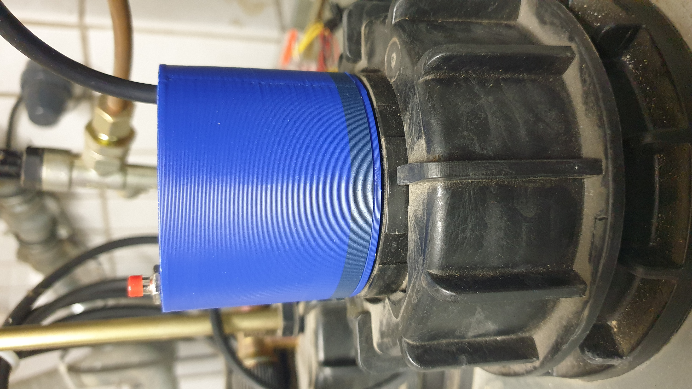
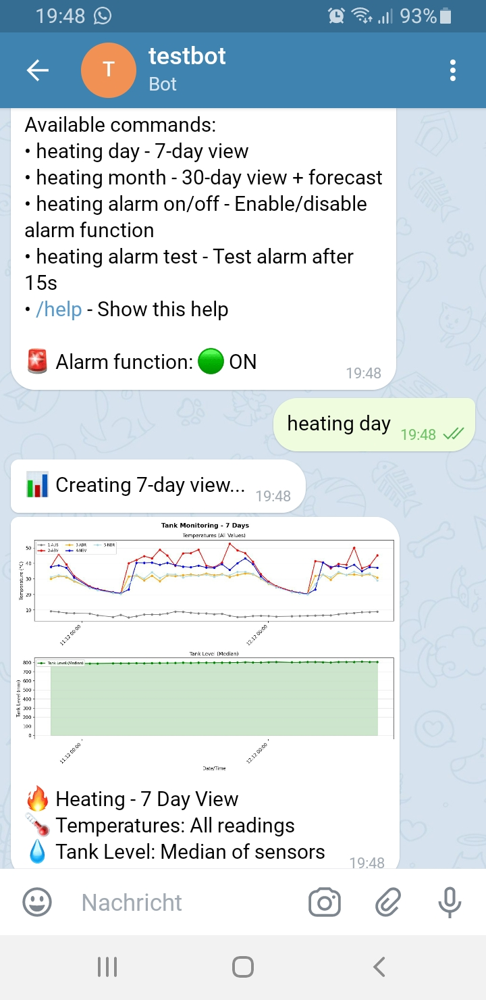

# Ultrasonic Level Meter with Temperature Sensors, Dashboard and Chatbot Integration

<table>
  <tr>    
    <td width="50%"></td>
    <td width="50%"></td>
  </tr>
</table>
</td>
 
# Overwiew

This tank level monitor measures the current fill level and temperatures using ultrasonic SR04 and DS18B20 sensors.
With this data, I want to learn more about the future sizing of a heat pump—see also my initial thoughts on this [here](https://github.com/MatthiasArno/heizungsgesetz). The features in detail:

* Mechanical
  * 3dp parts available
  * 3xAA battery powered
* ESP32-based ultrasonic level meter with support for 5 external temperature sensors
  * Web interface for sensor readings, log download and software update
  * MQTT publishing of sensor data
* Raspberry Pi server
  * Statistics dashboard
  * Telegram bot (for remote access and alarms)
  * Alerting when temperatures fall below critical values
  * Tank level forecasting using historical data and weather forecasts


## Security & Disclaimer

**IMPORTANT:** This is a hobby project for personal, non-commercial use in controlled environments. It is provided "as-is" without warranty. By using this project, you accept all risks and responsibilities.

**Known Security Limitations:**

* WiFi credentials stored in plaintext on ESP32/.env
* Web interface is http and has no authentication
* MQTT communication unencrypted by default
* No secure boot implementation

**Required Security Measures:**

* **MANDATORY:** Isolate device on guest network with no internet access
* **MANDATORY:** Secure physical access to prevent credential theft
* **MANDATORY:** Set your Telegram user-id to prevent unauthorized bot access
* **MANDATORY:** Never port-forward the web interface to the internet (applies to device and dashboard server)
* Use dedicated MQTT server (e.g., Raspberry Pi)
* Run services as non-root user (default: **tank**)

**Recommended Hardening (currently not implemented):**

* Enable ESP32 secure boot
* Implement MQTT client authorization
* Add web interface authentication

**You are solely responsible for:**
* Network security and isolation
* Physical device security
* Any consequences of unauthorized access
* Compliance with local regulations

**This device is NOT suitable for critical infrastructure or commercial deployments.**

## Safety

**WARNING:** This device operates near flammable liquids. Improper use may result in fire, injury, or property damage.

**FIRE HAZARD - Critical Requirements:**

* **ONLY use standard alkaline AA batteries** - Never use rechargeable batteries
* Rechargeable batteries can supply high currents causing excessive heat and fire risk
* Installation on oil tanks or near flammable materials requires extreme caution
* Regularly inspect for signs of battery leakage, corrosion, or overheating

**Battery Specifications:**

* Type: Standard alkaline AA batteries only
* Expected lifetime: ~1 year under normal conditions (varies with environmental conditions, see below)
* Replace immediately if device behavior becomes erratic

**Installation Safety:**

* Mount securely to prevent falls into tank or flammable materials
* Ensure all connections are properly insulated and separated

**User Responsibility:**

You assume all liability for safe installation, operation, and maintenance. The author accepts no responsibility for fire, equipment damage, or personal injury resulting from use of this device.

**If unsure about safe installation, consult a qualified professional.**

## Operation

* Sensors
  * 1-AUS : Outside Temperature (Außentemperatur)
  * 2-ABV: Old Building Flow (Altbau Vorlauf)
  * 3-ABR: Old Building Return (Altbau Rücklauf)
  * 4-NBV: New Building Flow (Neubau Vorlauf)
  * 5-NBR: New Building Return (Neubau Rücklauf)
  * device: ESP32, +20 above room temp right after power up (when sending mqtt messages)
* The device sends an MQTT message each full hour with topics
  * tank/1/level, with level=a,b,c,1, beeing 3 consecutive level measurements in mm plus 1 (a constant, see code)
  * tank/sensorID/temp, with sensorID=device or serial ID of the temperature sensor or its name-mapping
* Dynamic sleep time and report
  * Dynamic sleep less than one hour under following conditions
    * 15 mins if 1-AUS falls below 3 degrees Celsius
    * 5 mins if 1-AUS below -8 degrees Celsius
  * Report sent (alarm)
    * If any heating temperature falls below 17 degree
    * If 1-AUS is below 4 degree Celsius and any heating temperature falls below 25 degree
* Pushing the KEY button for 2..3s will restart in WebMode
  * Terminate by the WebIF Exit Button
  * Terminate by pushing the button for longer than 10s
  * Terminate by closing the browser window (60 seconds without request, e.g. time update in the WebIF)  
* Blue LED
  * Lights directly after restart until deep_sleep
  * Flashes 100ms with 1s period in WebMode
* Power LED
  * Is desoldered to save energy

## Programming

https://micropython.org/download/ESP32_GENERIC/


```bash
# Setup micropython V1.26.1 (recent as of this days)
esptool erase_flash
esptool --baud 460800 write_flash 0x1000 ESP32_BOARD_NAME-DATE-VERSION.bin
# Compile the biggest files
mpy-cross main_tank.py microdot.py
# Keep KEY button pressed on device if there is already a SW installed, then copy the files
# Never write programms that immediately shutdown/sleep the device: this needs a reflashing of the micropython image
mpremote cp main_tank.mpy microdot.mpy pf_esp32.py main.py env.py :/
# Keep button pressed, then CTRL-C/CTRL-D to restart in WEB Mode
```

# Micropython

It is required to compile main_tank.py, microdot.py, otherwise out of memory or strange behavior will be the result. 

Cross compile: https://docs.micropython.org/en/v1.14/develop/gettingstarted.html
mpy-cross ...


## Dependencies

* mpremote mip install umqtt.simple

## ESP32 D1 WROOM Resources
[ESP32 D1 Pinout](https://www.az-delivery.de/en/blogs/azdelivery-blog-fur-arduino-und-raspberry-pi/das-dreiundzwanzigste-turchen?srsltid=AfmBOoq3zANfTVwCHYACTTIp61QkXzp0ml7nrwgrVSA-XKt5bh0sfA7b)

## Modifications

* Remove Power Led (red) to save energy

## Pin Usage

USB points to south, only pins on the east upper and lower side are used. Color of the cable depends what you have available.

Outer row, from north, 4x:
- GND (black)
- GPIO27: SR04_ECHO_PIN (green)
- GPIO25: SR04_TRIGGER_PIN (yellow)
- GPIO32: SR04_PWR_OUT (POWER) (red)

Inner row, from south, 6x:
- GPIO17: Sensor_PLUS (white)
- GPIO16: Sensor_BUS (grey)
- GND: Batt_GND, Sensor_GND, KEY_GND
- 5V: Batt_PLUS
- GPIO15: KEY_IN (internal Pullup, RTC capable wakeup)
- nc

Sensor Cable:
- Brown : GND
- Grey: Signal Temp
- Yello : +3.3V Temp
- White : nc
- Green :nc

## Sensor Codings

Up to 5 external temperature sensors will be supported. 1wire sensors have a unique device id, which will be reported along with its temperature value. For better reading, the last 2 hex digits of this id are mapped onto a clear name, e.g. 1-AUS. See code for the mapping.

Example: 28d35452000000d6 : -> translates to { "d6": "1-AUS"... }

## WiFi Connection

Unstable WiFi results in strange behavior of the device. When using a repeater, do not operate it in mesh mode since esp32 always tries to connect to the mesh master, regardless of the signal strength of your repeater. Instead, give the repeater a dedicated SSID and connect to it.


 

